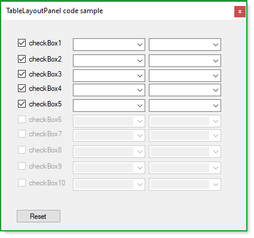

# About

Shows how to work with a [TableLayoutPanel](https://docs.microsoft.com/en-us/dotnet/desktop/winforms/controls/tablelayoutpanel-control-overview?view=netframeworkdesktop-4.8) for the following [forum question](https://docs.microsoft.com/en-us/answers/questions/232559/build-list-utilizing-for-loop-not-populating-list.html).

The focus is on enabling/disabling control in the TableLayoutPanel.

