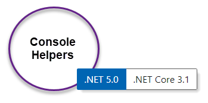

# About 



Contains helper methods for console projects done in .NET Core, to use in a .NET Framework project create a new class project targeting .NET 4.8 for instance, copy classes from this project into the other project, build and use.

Written in C#, works for VB.NET also.

:heavy_check_mark: [Documentation](https://github.com/karenpayneoregon/csharp-features/blob/master/ConsoleHelpers/ConsoleHelpers.md)

## ReadLine Wait with 

Predefined period where the [base method](https://github.com/karenpayneoregon/csharp-features/blob/master/ConsoleHelpers/ConsoleKeysHelper.cs#L58) accepts an int for seconds.

C# 

```csharp
var value = ReadLineFiveSeconds( "Please enter your name within the next 5 seconds.");
```

VB

```
Dim value = ReadLineFiveSeconds("Please enter your name within the next 5 seconds.")
```

