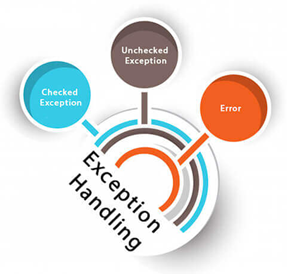

# About

Provides methods for logging

- Handle unhandled runtime exceptions
- Write exceptions caught in try-catch statements

# See

The [following project](https://github.com/karenpayneoregon/csharp-features/tree/master/ThreadExceptionWindowsFormsApp) for usage

 

