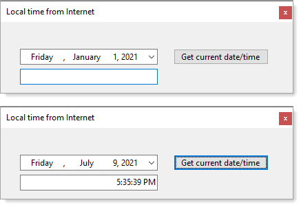

# About

Provides a class to get date/time from a Internet server.

When the application starts the DateTimePicker has 1/1/2021, click the Get current date/time button and if successful the current date shows in the DateTimePicker and the time in the TextBox.

