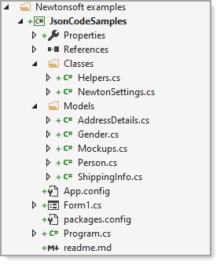

# Json Code Samples

## About

Demonstrates using Newtonshoft Json.net how to

:heavy_check_mark: serialize a single item

:heavy_check_mark: serialize a list of an item

:heavy_check_mark: with nested properties

- Mockups.cs contains mock-ups to test.
- NewtonSettings.cs contains predone settings for serializing
- Helpers.cs contain generic methods to serialize and deserialize items or list
- [Documentation](https://github.com/karenpayneoregon/csharp-features/blob/master/JsonCodeSamples/Docs/JsonCodeSamples.md)


<table>
    <tr>
        <td>The code samples may be a bit much if new to working with json. Best to study the code along with using Visual Studio's debugger to understand working with generics and inheriting classes.</td>
    </tr>
</table>

</br>




---

## Requires

NuGet packages

- [System.ValueTuple](https://www.nuget.org/packages/System.ValueTuple/)
- [Newtonsoft.Json](https://www.nuget.org/packages/Newtonsoft.Json/)

---


## Sample classes


**Gender** class

```csharp
public enum Gender
{
    Male,
    Female,
    Other

}
```

**Person** class

```csharp
public class Person
{

    [JsonProperty(PropertyName = "FirstName")]
    public string firstname { get; set; }

    [JsonProperty(PropertyName = "LastName")]
    public string lastname { get; set; }

    [JsonProperty(PropertyName = "Gender")]
    public Gender gender { get; set; }
}
```

**Nested** class for next class

```csharp
public class AddressDetails
{
    public string Street { get; set; }
    public string City { get; set; }
    public string State { get; set; }
    public string PostalCode { get; set; }
    public override string ToString() => $"{Street}\n{City}\n{State}\n{PostalCode}";

}
```

**Main** class

```csharp
public class ShippingInfo : Person
{
    [JsonIgnore]
    public int Id { get; set; }
    public AddressDetails AddressDetails { get; set; }
    public override string ToString() => $"{firstname} {lastname} is {gender}\n{AddressDetails}\n";

}
```
</br>

