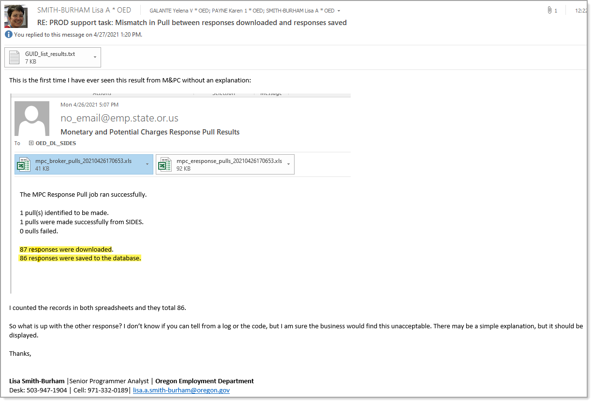
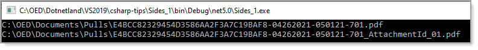

# About

In response to the email issue below with `downloads` not matching `saved` to database.

- Email.txt contains a list of guids to check against guids in an email auto sent after a pull request has completed for SIDE MPC
- Excel file contains guids from the mpc_resonse_pulls`date`.xls file.
- Copy .pdf pull files for the date in question in C:\OED\Documents\Pulls e.g. if the data in question is 04/26/2021 copy them to the folder C:\OED\Documents\Pulls. Running locally rather than from the server will be faster execution.
- Compile/run
- If a difference is found they will be shown as seen in figure 1.
  - Copy and paste to whomever needs them e.g. team lead or lead senior team member.

---

# Figure 1

