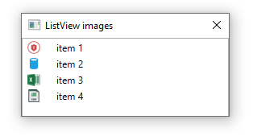

# About

Starter code sample for placing images in the first column of a ListView 

### Requires

:heavy_check_mark: Microsoft Visual Studio 2019

:heavy_check_mark: .NET Core 5

:heavy_check_mark: C#

